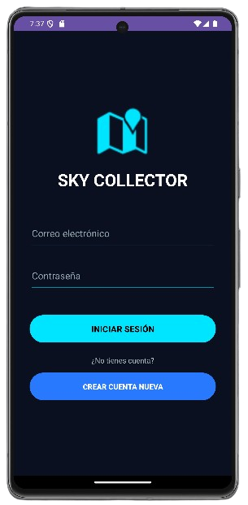
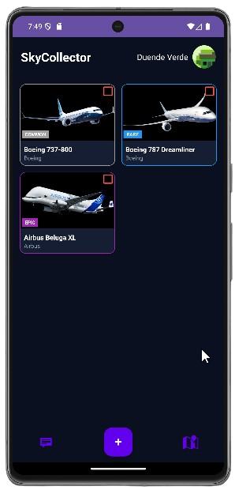
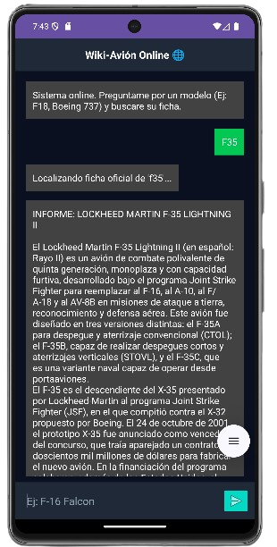
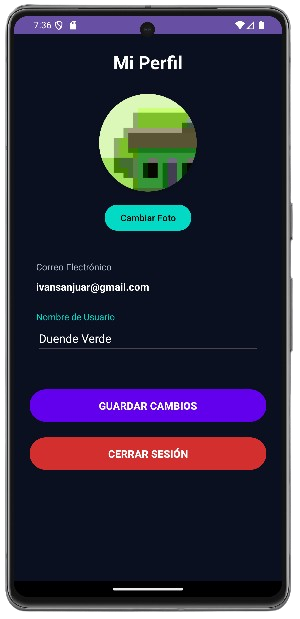
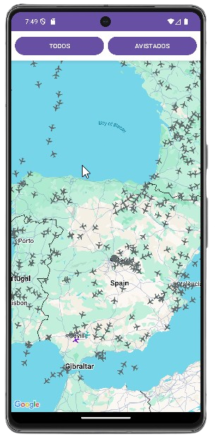
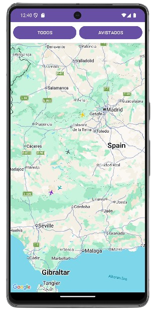
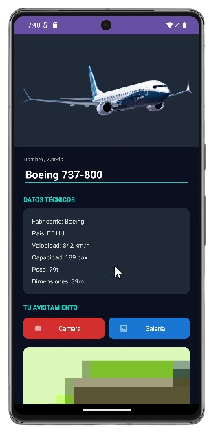
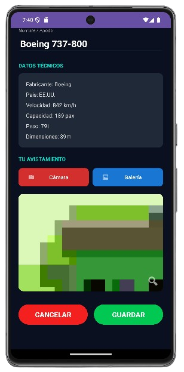
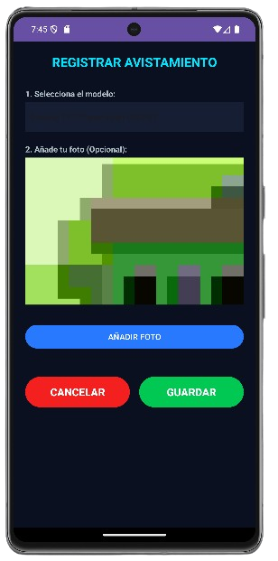
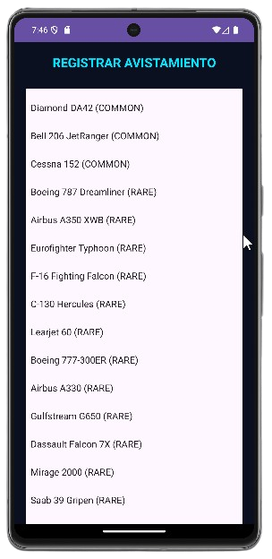

# ✈️ SkyCollectorApp

**SkyCollectorApp** es una aplicación Android desarrollada en **Java** como proyecto de 2º DAM.
Permite gestionar una colección de aviones, visualizar vuelos reales en un mapa y consultar información aeronáutica mediante una API externa.

Proyecto académico orientado a demostrar desarrollo Android completo: interfaz, consumo de API, arquitectura modular y visualización de datos en tiempo real.

---

## 📱 Descripción

SkyCollectorApp combina:

* Colección personal de aviones
* Visualización de vuelos reales en mapa
* Consulta de datos aeronáuticos
* Chat interno
* Perfil de usuario

La aplicación integra datos reales de tráfico aéreo con una interfaz Android organizada por paquetes.

---

## 🌍 API utilizada

Para la funcionalidad del mapa se utiliza la **API de OpenSky Network**, que proporciona:

* Posición de aviones en tiempo real
* Coordenadas geográficas
* Identificación de vuelos
* Información de seguimiento

Estos datos se consumen desde la app y se representan en el mapa dentro de **MapaActivity**.

---

## 🧠 Tecnologías usadas

* Java
* Android Studio
* Android SDK
* XML layouts
* RecyclerView
* API REST (OpenSky)
* Gradle
* Git / GitHub

---

## 🏗️ Estructura del proyecto

```
app/
├── manifests/
│   └── AndroidManifest.xml
│
├── java/es.medac.skycollectorapp/
│   ├── activities/
│   │   ├── AddAvionActivity.java
│   │   ├── ChatbotActivity.java
│   │   ├── DetalleAvionActivity.java
│   │   ├── LoginActivity.java
│   │   ├── MainActivity.java
│   │   ├── MapaActivity.java
│   │   ├── PerfilActivity.java
│   │   └── TrackResponse.java
│   │
│   ├── adapters/
│   │   ├── AvionAdapter.java
│   │   └── ChatAdapter.java
│   │
│   ├── models/
│   │   ├── Avion.java
│   │   ├── FlightResponse.java
│   │   └── Mensaje.java
│   │
│   ├── network/
│   │   └── FlightRadarService.java
│   │
│   └── utils/
│       └── AvionGenerator.java
│
├── res/
│   ├── layout/
│   ├── drawable/
│   ├── menu/
│   ├── mipmap/
│   ├── values/
│   └── xml/
```

---

## 🧩 Funcionalidades principales

* Login de usuario
* Registro de aviones
* Colección personal
* Visualización en mapa
* Datos reales de OpenSky
* Chatbot interno
* Perfil de usuario
* Detalle de aviones

---

## 🖼️ Capturas de la aplicación

### 🔐 Inicio de sesión



### 🛩️ Colección de aviones



### 🤖 Chatbot



### 👤 Perfil



### 🗺️ Mapa Generico y Avistados filtrados (OpenSky API)

 


### ✈️ Detalle de los Aviones

 

### 📸 Registro de Aviones

 

---

## ▶️ Ejecución

```bash
git clone https://github.com/Ivannovichh/SkyCollectorApp.git
```

Abrir en Android Studio → Sync Gradle → Ejecutar en emulador o móvil.

---

## 👨‍💻 Autores

**Iván Sánchez**
**Ángel Japón**

2º DAM — Desarrollo de Aplicaciones Multiplataforma

---

## 🧩 Enlaces de interés

- Enlace a Google Forms sobre la encuesta: https://forms.gle/a42kbaB4RF5ejABD9

- Enlace a Figma v1: https://attic-froze-16880795.figma.site
  
- Enlace a Figma v2: https://malt-easy-43617739.figma.site
  
- Enlace a Presentación Canva: https://www.canva.com/design/DAHAz2c4FQA/Qzy9MLAS-Lw6a1nU65PRug/edit?utm_content=DAHAz2c4FQA&utm_campaign=designshare&utm_medium=link2&utm_source=sharebutton

---

## 🎓 Proyecto académico

Aplicación desarrollada como proyecto de DAM integrando:

* Consumo de API real (OpenSky)
* Mapa con vuelos en directo
* Arquitectura Android modular
* RecyclerViews
* Navegación entre activities
* GitHub

---

## ✈️ SkyCollectorApp

Aplicación Android de colección y visualización de tráfico aéreo en tiempo real.
